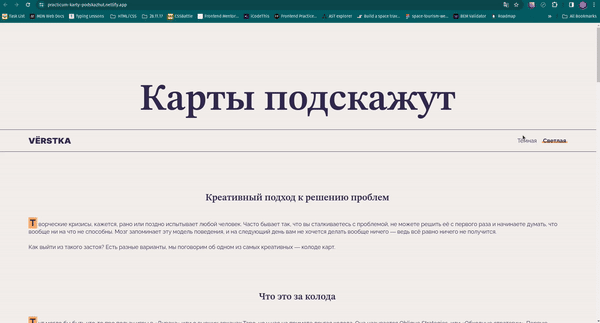

# Karty-podskazhut

A HTML, CSS and Vanilla JavaScript project form Yandex.Practicum «Frontend Developer» course.

This project was created to focus on creating responsive websites, that would look good on various devices and and browsers. The website can be toggled between Dark and Light themes.

### Project Checklist

  
use <b>&lt;picture&gt;</b> tag to load only image optimal for current device

  <pre><code>&lt;picture&gt;
    &lt;source srcset="./images/cards-1x.avif 1x" type="image/avif" /&gt;
    &lt;source srcset="./images/cards-2x.avif 2x" type="image/avif" /&gt;
    &lt;source srcset="./images/cards-1x.webp 1x" type="image/webp" /&gt;
    &lt;source srcset="./images/cards-2x.webp 2x" type="image/webp" /&gt;
    &lt;img
        srcset="./images/cards-1x.png 1x, ./images/cards-2x.png 2x"
        loading="lazy"
        class="content__picture"
        alt="Картинка с блокнотом, телефоном и карточкой с надписью Trust in the you of now"
    /&gt;
&lt;/picture&gt;
</code></pre>

  
implement <b>dark/light theme toggler</b> using custom css properties

  <pre><code>:root {
  --bg-color: #f3efec;
  --text-color: #312a4e;
  --accent-color: #ffab6b;
  --main-font: Raleway;
  --accent-font: 'STIX Two Text';
}
.theme_dark {
--bg-color: #171717;
--text-color: #b3b3b3;
--accent-color: transparent;
}
</code></pre>

  
use <b>relative units of measurement</b> for adaptive layout

  <pre><code>.header {
  padding-block-start: 10vi;
}
</code></pre>

  
use <b>CSS functions</b>

  <pre><code>.header__title {
  font-size: clamp(3.75rem, 2.5rem + 5.5556vw, 7.5rem);
}
.content__figure {
  inline-size: calc(100% + 10vi);
}
</code></pre>

### Figma Layout

Click [here](<https://www.figma.com/file/wdZurx6BngCbVUyOI3paLi/%235-%D0%9A%D0%B0%D1%80%D1%82%D1%8B-%D0%BF%D0%BE%D0%B4%D1%81%D0%BA%D0%B0%D0%B6%D1%83%D1%82-(Copy)?type=design&node-id=0%3A1&mode=dev&t=voAdteEyJsmzYBzi-1>) to open Website Figma Layout

### Project Demo

Link to project website: https://practicum-karty-podskazhut.netlify.app/

Website Preview:

